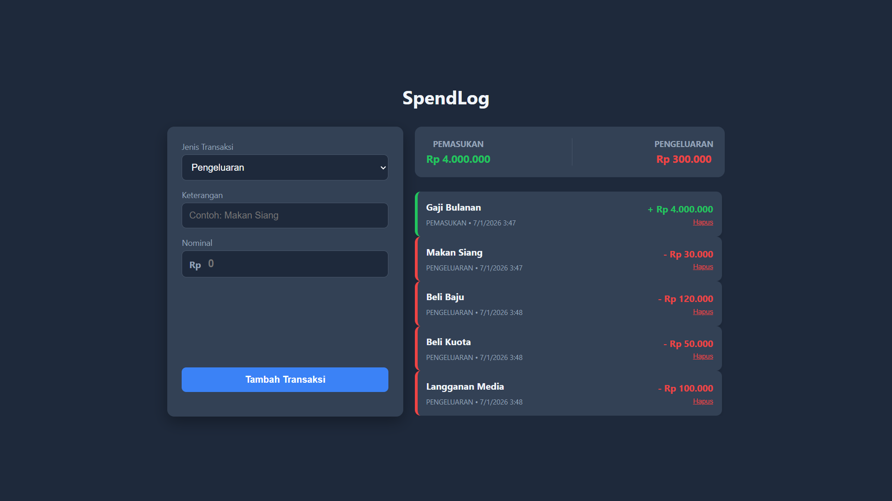

# SpendLog (Vanilla JS)

A web-based application to track daily income and expenses efficiently. This project serves as my **starting point** in mastering the JavaScript ecosystem, focusing on understanding the core logic of DOM manipulation and Data Structures before moving to modern frameworks.



## About SpendLog

SpendLog was built to solve a simple problem: recording where money goes. However, the main goal behind this project is **educational**. I wanted to challenge myself to build a functional CRUD (Create, Read, Update, Delete) application using **Pure JavaScript** without relying on any frontend libraries like React or Vue initially.

### Key Features
* **Transaction Recording:** Add income or expense details.
* **Real-time Calculation:** Automatically calculates total balance, total income, and total expense.
* **Data Persistence:** Uses browser `localStorage` so data remains safe even after refreshing the page.
* **Currency Formatting:** Auto-format numbers to Indonesian Rupiah (IDR).
* **Responsive UI:** A balanced "Twin Box" layout that works on Desktop and Mobile.

## Transparency & Learning Process

In the spirit of honesty and open-source learning, I want to be transparent about how SpendLog was built:

* **The Logic (100% Me):**
    All the JavaScript logic, including data processing, array manipulation (`map`, `filter`, `reduce`), DOM manipulation, validation, and `localStorage` management, was written by myself. I focused heavily on understanding how data flows in a web application.
* **The UI/UX (AI-Assisted):**
    To ensure the application looks professional and user-friendly, I utilized AI assistance (Gemini) to help design the CSS architecture (Flexbox layouts, color palette, and responsiveness). This allowed me to focus my learning energy on the JavaScript logic while still producing a polished visual result.

## Tech Stack

* **HTML5** - Semantic structure.
* **CSS3** - Flexbox, Responsive Design, Dark Mode aesthetics.
* **Vanilla JavaScript (ES6+)** - Core logic, Event Handling, DOM Manipulation.

## Future Roadmap (Scalability Plan)

SpendLog is just **Phase 1**. I have a structured plan to scale this application into a full-stack product to demonstrate my growth as a developer:

* **Phase 1 (Current):** Solidify Vanilla JS logic and LocalStorage. ✅
* **Phase 2 (Visualization):** Integrate **Chart.js** to show spending habits visually.
* **Phase 3 (Backend Integration):** Migrate from `localStorage` to a real backend using **Node.js & Express.js**.
* **Phase 4 (Database):** Implement **MongoDB/MySQL** to store user data permanently.
* **Phase 5 (Modern Frontend):** Rebuild the User Interface using **React.js** to manage state more efficiently.

## How to Run

1.  Clone this repository:
    ```bash
    git clone [https://github.com/yourusername/spendlog.git](https://github.com/yourusername/spendlog.git)
    ```
2.  Open the folder.
3.  Double click `index.html` to open it in your browser.

---
